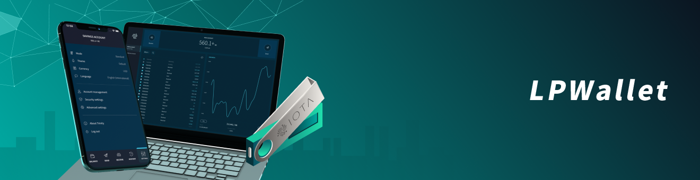

<h1 align="center">
  <br>
  <a href="https://docs.dag-lp.com/docs/wallets/0.1/trinity/introduction/overview"></a>
</h1>

<h2 align="center">The official LP wallet</h2>

<p align="center">
    <a href="https://docs.dag-lp.com/docs/wallets/0.1/trinity/introduction/overview" style="text-decoration:none;">
    
</p>
<p align="center">
  <a href="https://discord.dag-lp.com/" style="text-decoration:none;"></a>
    <a href="https://iota.stackexchange.com/" style="text-decoration:none;"></a>
    <a href="https://raw.githubusercontent.com/iotaledger/trinity-wallet/develop/LICENSE" style="text-decoration:none;"></a>
    <a href="https://dependabot.com" style="text-decoration:none;"></a>
</p>
      
<p align="center">
  <a href="#about">About</a> ◈
  <a href="#prerequisites">Prerequisites</a> ◈
  <a href="#installation">Installation</a> ◈
  <a href="#getting-started">Getting started</a> ◈
  <a href="#supporting-the-project">Supporting the project</a> ◈
  <a href="#joining-the-discussion">Joining the discussion</a> 
</p>

---

## About

This is the **official** LP wallet, which allows you to do the following:
* Create password-protected accounts to store and access your seeds
* Send transactions
* Generate addresses
* Read your balance and transaction history

Please report any issues in our [issue tracker](https://github.com/loveandpeople/wallet/issues/new).

## Prerequisites

To compile LPWallet, you must have the following:

* [Node.js 10 (>=10.19) or 11](https://nodejs.org/dist/)
* [Yarn](https://yarnpkg.com/) package manager.

## Installation

The latest downloadable versions of LPWallet are available on the [Trinity website](https://wallet.dag-lp.com/).

If you want to run a local version of LPWallet, compile the code by doing the following:

1. Clone this repository

    ```
    git clone https://github.com/loveandpeople/wallet.git
    ```

2. Change into the `LPWallet` directory

    ```
    cd wallet
    ```

3. Install the shared dependencies

    ```
    yarn && yarn deps:shared
    ```

4. Follow the instructions to compile either [LPWallet Mobile](https://github.com/loveandpeople/wallet/blob/develop/src/mobile/README.md) or [LPWallet Desktop](https://github.com/loveandpeople/wallet/blob/develop/src/desktop/README.md).

## Getting started

If you want help getting started as a user of the wallet, see the [documentation portal](https://docs.dag-lp.com/docs/wallets/0.1/introduction/overview).

If you are contributing to the LPWallet codebase, see the following resources:

- [How to develop new features in LPWallet](https://docs.dag-lp.com/docs/wallets/0.1/how-to-guides/develop-features-on-wallet)
- [Contributing guidelines](.github/CONTRIBUTING.md)

## Supporting the project

If LPWallet has been useful to you and you feel like contributing, consider posting a [bug report](https://github.com/loveandpeople/wallet/issues/new?labels=T+-+Bug&template=bug_report.md&title=), [feature request](https://github.com/loveandpeople/wallet/issues/new?labels=&template=feature_request.md&title=) or a [pull request](https://github.com/loveandpeople/wallet/pulls/).

See the [contributing guidelines](.github/CONTRIBUTING.md) for more information.

## Joining the discussion

If you want to get involved in the community, need help with getting setup, have any issues related to LPWallet or just want to discuss LP, Distributed Ledger Technology (DLT) and IoT with other people, feel free to join our [Discord](https://discord.dag-lp.com/).
